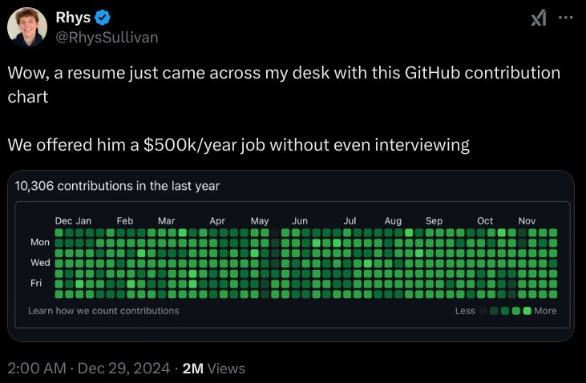

# MGGA: Make GitHub Green Again

Ever felt bad about your coding abilities because your GitHub commit graph didn't look something like this?


I've been somewhat frustrated recently because I was making a bunch of commits and PRs to a repo, yet my friend squashed everything before merging it into the main branch, which meant that if you just purely looked at my GitHub commit graph, it would seem like I did zero work even though I wrote thousands and thousands of lines of code. So I decided to make this tool to accurately reflect how much I've been coding recently.

## How to Use
Navigate to the `src/` directory containing all of the scripts. First of all, make all scripts executable:
```
chmod +x create_dummy_directory.sh
chmod +x create_gh_repo.sh
chmod +x automate_commits.sh
```

Now, create your dummy directory by passing a name as the first argument:
```
./create_dummy_directory.sh my-repo-name
```

Then, turn this directory into a GitHub repository:
```
./create_gh_repo.sh my-repo-name
```

Automate the final script to run daily. First, edit your Crontab config file:
```
crontab -e
```

Add the following line to your Crontab config file to ensure that it runs every day:
```
30 7 * * * /src/automate_commits.sh >> /tmp/commit_spammer.log 2>&1
```

That's it! You're all set to go!
